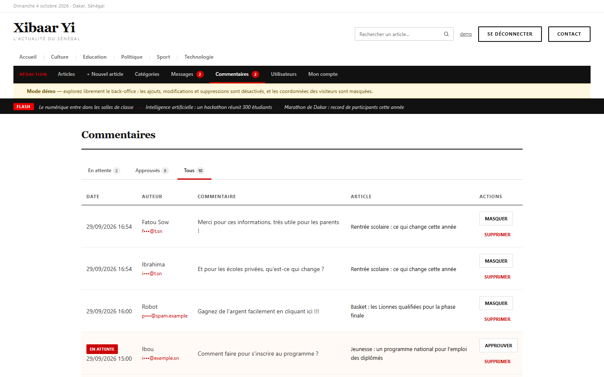

# Xibaar Yi

[English](README.md) · **Français**

**Xibaar Yi** (« les nouvelles » en wolof) est un site d'actualité sénégalaise développé en **PHP / MySQL**,
sans framework : un site public où les lecteurs parcourent, recherchent et commentent les articles, et un
back-office où la rédaction publie et modère le contenu.

**Démo en ligne : [https://xibaaryi.infinityfreeapp.com](https://xibaaryi.infinityfreeapp.com)** : pour visiter le back-office, connectez-vous
avec `demo` / `demo1234` (compte en lecture seule : tout est visible, rien ne peut être modifié).


## Points forts

- **Sans framework** : routes, sessions, contrôle d'accès, protection CSRF, envoi d'images et pagination sont
  écrits à la main, pour comprendre ce que font les frameworks.
- **Sécurité** : requêtes préparées, mots de passe bcrypt, jetons CSRF, limite des tentatives de connexion,
  images vérifiées par leur contenu, échappement XSS partout (détails plus bas).
- **En ligne sur un hébergement mutualisé** (InfinityFree) : des règles `.htaccess` n'exposent que `public/`,
  les identifiants sont dans un fichier ignoré par Git, et les erreurs PHP vont dans le journal, jamais à l'écran.
- **De vrais titres, sans cron** : les titres sont importés des flux RSS de médias sénégalais (APS, Le Soleil,
  wiwsport...) et rangés par rubrique grâce à des mots-clés. L'hébergeur gratuit n'a pas de tâches planifiées :
  l'import se lance au plus toutes les 3 heures, une fois la page d'un visiteur envoyée, avec un verrou MySQL.
- **Mode démo en lecture seule** : un rôle `demo` ouvre toutes les pages du back-office, mais tout envoi de
  formulaire est refusé à un seul endroit (`exiger_role()`), et les données privées (messages, commentaires en attente,
  coordonnées, logins) sont masquées.

## Fonctionnalités

**Partie publique**
- Vrais titres de l'actualité sénégalaise (titre, courte accroche, photo créditée au média, lien vers l'article original), mis à jour automatiquement
- Derniers articles avec pagination, filtre par catégorie et recherche (titre, résumé, contenu)
- Page article avec compteur de vues (« Les plus lus ») et suggestions « À lire aussi »
- Commentaires publiés après validation par la rédaction (champ piège anti-robots + un commentaire toutes les 30 s)
- Inscription à la newsletter et formulaire de contact, enregistrés en base
- Site adapté aux téléphones et tablettes

**Back-office**

| Rôle | Articles | Catégories | Messages et commentaires | Utilisateurs |
|------|:--------:|:----------:|:------------------------:|:------------:|
| Éditeur | ✅ | ✅ | ✅ | ❌ |
| Administrateur | ✅ | ✅ | ✅ | ✅ |
| Démo | 👁 lecture seule | 👁 | 👁 (coordonnées masquées) | 👁 |

- Gestion des articles avec image, recherche par titre et filtre par catégorie
- Modération des commentaires (en attente / approuvés), messages de contact avec compteur de non lus
- Gestion des utilisateurs pour l'administrateur ; « Mon compte » pour modifier ses informations et son mot de passe

<p>
  
  
</p>

## Technologies

- **PHP 8** (PDO, sessions), sans framework ni dépendance Composer
- **MySQL 8** : 8 tables reliées par des clés étrangères, schéma dans [`database/database.sql`](database/database.sql),
  migrations dans [`database/migrations/`](database/migrations/)
- **HTML / CSS / JavaScript** (vérification des formulaires ; le serveur revérifie toujours)
- Hébergé chez **InfinityFree** (Apache), mis en ligne par FTP

## Sécurité

| Menace | Protection |
|---|---|
| Injection SQL | requêtes préparées PDO partout ; jokers `LIKE` échappés dans la recherche |
| Mots de passe volés | `password_hash()` / `password_verify()` (bcrypt) ; anciens hash SHA-256 convertis à la connexion |
| Mots de passe devinés | connexion bloquée 15 minutes après 5 échecs depuis la même adresse IP |
| CSRF | jeton secret dans chaque formulaire du back-office ; suppressions et déconnexion uniquement en POST |
| XSS | tout texte saisi est affiché avec `htmlspecialchars()` |
| Vol de session | `session_regenerate_id()` à la connexion et au changement de mot de passe ; cookie `HttpOnly` + `SameSite` |
| Fichier dangereux | type de l'image vérifié sur son contenu (`getimagesize`), nom aléatoire, aucun script exécutable dans `uploads/` |
| Droits périmés | le rôle est relu en base à chaque page : un utilisateur rétrogradé ou supprimé perd l'accès immédiatement |
| Fuite d'informations | erreurs de base de données dans le journal PHP ; message neutre pour le visiteur |

Détails dans [docs/architecture.md](docs/architecture.md).

## Installation en local

Prérequis : PHP 8 avec `pdo_mysql`, MySQL 8 (Laragon, XAMPP, WAMP ou installation classique).

```bash
git clone https://github.com/lambiss12-hue/Xibaar_Yi.git
cd Xibaar_Yi

mysql -u root -e "CREATE DATABASE xibaar_yi CHARACTER SET utf8mb4 COLLATE utf8mb4_unicode_ci"
mysql -u root xibaar_yi < database/database.sql
mysql -u root xibaar_yi < database/demo.sql      # optionnel : 15 articles de plus, commentaires, messages

php -S localhost:8000 -t public
```

Puis ouvrir <http://localhost:8000>. Avec phpMyAdmin : créer la base, la sélectionner, puis **Importer**
`database/database.sql` (et `demo.sql` si besoin). Avec Laragon / XAMPP, on peut aussi placer le dossier dans
`www/` (ou `htdocs/`) et ouvrir <http://localhost/Xibaar_Yi/public/> : les liens sont construits par la fonction
`url()`, le site marche quel que soit le dossier.

| Login | Mot de passe | Rôle |
|-------|--------------|------|
| `admin` | `admin123` | administrateur |
| `demo` | `demo1234` | démo (lecture seule) |
| `fatou`, `moussa` | `redac123` | éditeurs (avec `demo.sql`) |

> ⚠️ Changer ces mots de passe sur tout serveur public (sauf celui du compte `demo`, qui ne peut rien modifier).

**Base déjà existante ?** Exécuter les scripts de `database/migrations/` qui manquent (une seule fois chacun).

**Configuration** : les paramètres sont dans [`includes/config.php`](includes/config.php) (`root` sans mot de passe
sur le port 3306 ; variable d'environnement `DB_PORT` pour un autre port). En ligne, copier
[`includes/config.local.exemple.php`](includes/config.local.exemple.php) en `includes/config.local.php` avec les
identifiants de l'hébergeur : ce fichier est ignoré par Git.

## Structure du projet

```
Xibaar_Yi/
├── public/                  racine web (seul dossier exposé au navigateur)
│   ├── index.php            accueil (liste, recherche, pagination)
│   ├── article.php          détail d'un article + commentaires
│   ├── connexion.php / deconnexion.php
│   ├── contact.php, traitement_*.php
│   ├── admin/               back-office : articles, catégories, commentaires,
│   │                        messages, utilisateurs, compte.php
│   ├── assets/              CSS, favicon, image d'aperçu
│   └── uploads/             images des articles
├── includes/
│   ├── config.php           connexion BDD, session, url(), date_fr()
│   ├── auth.php             exiger_role(), mode démo, jeton CSRF
│   ├── upload.php           vérification et nettoyage des images
│   ├── entete.php / pied.php / meta.php
│   └── message_newsletter.php
├── database/                database.sql, demo.sql, migrations/
└── docs/                    architecture, base de données, captures d'écran
```

## Ajouter une page d'administration

```php
<?php
require_once __DIR__ . '/../../../includes/auth.php';
exiger_role(['editeur', 'administrateur']);   // ou ['administrateur']
// Le compte démo est accepté partout en lecture : ses envois POST sont refusés ici.

// ... traitement ...

require_once __DIR__ . '/../../../includes/entete.php';
?>
<!-- Action sensible (suppression...) : formulaire POST + jeton CSRF -->
<form method="POST" action="<?= url('admin/categories/supprimer.php') ?>">
    <?= csrf_champ() ?>
    <input type="hidden" name="id" value="3">
    <button type="submit">Supprimer</button>
</form>
<?php require_once __DIR__ . '/../../../includes/pied.php'; ?>
```

## Documentation

| Document | Contenu |
|---|---|
| [docs/architecture.md](docs/architecture.md) | organisation du code, construction d'une page, rôles, mesures de sécurité |
| [docs/base-de-donnees.md](docs/base-de-donnees.md) | schéma de la base, tables, relations, migrations |
| [docs/demo.md](docs/demo.md) | scénario de la démo de soutenance et réponses aux questions du jury |

## Crédits

La première version a été réalisée en équipe à l'**École Supérieure Polytechnique (ESP) de Dakar** par
**Salamba Diène** et **Fatoumata Mandioula Diallo**. Le projet est depuis maintenu par Salamba Diène :
mise en ligne, renforcement de la sécurité, corrections et mode démo en lecture seule.

## Licence

[MIT](LICENSE)
