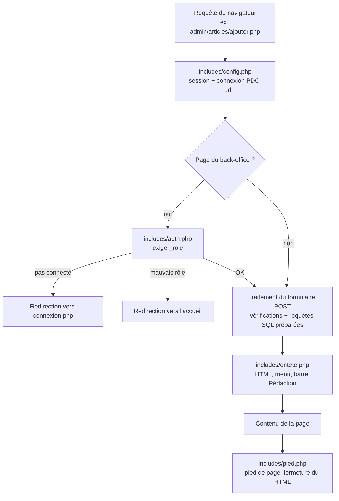

# Architecture — Xibaar Yi

Site d'actualité en **PHP 8 sans framework**, base **MySQL** via **PDO**.
Le but : un code simple à lire, où chaque page est un fichier PHP.

## Organisation des dossiers

```
Xibaar_Yi/
├── public/        ← seul dossier accessible depuis le navigateur (racine web)
│   ├── *.php      pages publiques + traitements des formulaires visiteurs
│   ├── admin/     back-office (accès réservé à la rédaction)
│   ├── assets/    CSS
│   └── uploads/   images des articles
├── includes/      code commun, JAMAIS accessible directement par une URL
└── database/      schéma SQL + migrations
```

**Pourquoi `public/` ?** Le navigateur ne peut ouvrir que ce qui est dans `public/`.
`includes/config.php`, qui contient les identifiants de la base, est donc hors de portée :
impossible de le télécharger avec une URL.

## Comment une page est construite

Toutes les pages suivent le même schéma :



Exemple réel (`public/admin/categories/ajouter.php`, simplifié) :

```php
require_once __DIR__ . '/../../../includes/auth.php';   // config + fonctions de sécurité
exiger_role(['editeur', 'administrateur']);              // sinon : redirection

if ($_SERVER['REQUEST_METHOD'] === 'POST' && !csrf_valide()) {
    $erreur = "Le formulaire a expiré.";
} elseif ($_SERVER['REQUEST_METHOD'] === 'POST') {
    $stmt = $pdo->prepare("INSERT INTO categories (nom) VALUES (?)");
    $stmt->execute([$nom]);
}

require_once __DIR__ . '/../../../includes/entete.php'; // puis le HTML de la page
```

Le traitement est fait **avant** d'afficher l'en-tête : on peut encore rediriger
(`header('Location: ...')`), ce qui est impossible une fois du HTML envoyé.

## Les fichiers communs (`includes/`)

| Fichier | Rôle |
|---|---|
| `config.php` | démarre la session, se connecte à MySQL (PDO), définit `url()` et `motif_like()` |
| `auth.php` | `exiger_role()`, jeton CSRF : `csrf_champ()`, `csrf_valide()`, `exiger_post_csrf()` |
| `upload.php` | `enregistrer_image()` : vérifie et enregistre une image envoyée |
| `actualites.php` | import des titres depuis les flux RSS (sources, rubriques par mots-clés, nettoyage) |
| `entete.php` | début du HTML, recherche, menu des catégories, barre « Rédaction » |
| `pied.php` | pied de page, fin du HTML |
| `message_newsletter.php` | message affiché après une inscription à la newsletter |

### `url()` : des liens qui marchent partout
Au lieu d'écrire `/Projet back-end/Xibaar_Yi/index.php` en dur, on écrit `url('index.php')`.
`config.php` calcule tout seul où se trouve `public/` par rapport à la racine du serveur :
le site fonctionne avec Laragon, XAMPP ou `php -S`, quel que soit le nom du dossier.

## Rôles et droits

| | Visiteur | Démo | Éditeur | Administrateur |
|---|:-:|:-:|:-:|:-:|
| Lire les articles, rechercher, commenter, contact, newsletter | ✅ | ✅ | ✅ | ✅ |
| Articles : ajouter, modifier, supprimer | ❌ | 👁 | ✅ | ✅ |
| Catégories | ❌ | 👁 | ✅ | ✅ |
| Messages de contact, modération des commentaires | ❌ | 👁 | ✅ | ✅ |
| Mon compte (infos + mot de passe) | ❌ | 👁 | ✅ | ✅ |
| Utilisateurs | ❌ | 👁 | ❌ | ✅ |

👁 = page visible, mais aucun envoi de formulaire n'est accepté. Le compte **démo** (`demo` / `demo1234`)
sert aux visiteurs du portfolio : `exiger_role()` le laisse ouvrir toutes les pages du back-office
et refuse toutes ses requêtes POST, avant que la page ne traite quoi que ce soit.
Les emails et téléphones des visiteurs et de la rédaction lui sont masqués (`masquer_si_demo()`).

Le contrôle est fait **côté serveur** par `exiger_role()` au début de chaque page admin.
Cacher un lien dans le menu ne suffit pas : quelqu'un pourrait taper l'adresse à la main.

## Sécurité

| Risque | Protection | Où dans le code |
|---|---|---|
| **Injection SQL** | requêtes préparées PDO (`prepare` + `execute`), jamais de variable collée dans le SQL | toutes les pages |
| **XSS** (code JavaScript injecté) | tout texte saisi par un visiteur ou un rédacteur (titres, commentaires, noms, recherche...) est affiché via `htmlspecialchars()` ; le reste n'est que des identifiants numériques ou des valeurs fixées par le code | toutes les pages |
| **Mots de passe volés** | `password_hash()` / `password_verify()` (bcrypt + sel) ; anciens hash SHA-256 convertis à la connexion | `connexion.php`, `admin/utilisateurs/`, `admin/compte.php` |
| **Mots de passe devinés** (un robot essaie des milliers de mots de passe) | 5 échecs en 15 minutes depuis la même adresse IP = connexion bloquée jusqu'à la fin des 15 minutes | `connexion.php`, table `tentatives_connexion` |
| **Vol de session** | nouvel identifiant de session à la connexion et au changement de mot de passe (`session_regenerate_id`) | `connexion.php`, `admin/compte.php` |
| **CSRF** (un autre site déclenche une action à votre place) | jeton secret dans chaque formulaire du back-office | `includes/auth.php` |
| **Suppression par simple lien** | suppressions et déconnexion uniquement en POST avec jeton | `admin/*/supprimer.php`, `admin/*/action.php`, `deconnexion.php` |
| **Perte de données** | refus de supprimer une catégorie ou un auteur qui a des articles | `admin/categories/supprimer.php`, `admin/utilisateurs/supprimer.php` |
| **Fichier dangereux envoyé** (ex. `virus.php` renommé `photo.jpg`) | contenu vérifié par `getimagesize()`, 5 Mo max, nom aléatoire, extension selon le vrai type | `includes/upload.php` |
| **Accès aux fichiers sensibles** | seule `public/` est exposée | structure des dossiers |
| **Fuite d'informations** | erreur de base de données écrite dans le journal PHP, message neutre au visiteur | `includes/config.php` |
| **Redirection vers un autre site** | les pages de « retour » sont choisies dans une liste fermée | `traitement_newsletter.php`, `admin/articles/supprimer.php` |
| **Spam des commentaires** | champ piège invisible + 1 commentaire / 30 s + validation par la rédaction | `traitement_commentaire.php` |
| **Texte mal encodé** qui ferait planter la page | `mb_check_encoding()` sur les formulaires publics | `traitement_commentaire.php`, `traitement_contact.php` |
| **Recherche piégée** (`%` qui renverrait tout) | jokers SQL échappés | `motif_like()` dans `config.php` |

## Fonctionnalités et fichiers

| Fonctionnalité | Fichiers |
|---|---|
| Accueil, pagination, filtre catégorie, recherche, « Les plus lus » | `public/index.php` |
| Lecture d'un article, compteur de vues, commentaires | `public/article.php`, `public/traitement_commentaire.php` |
| Connexion / déconnexion | `public/connexion.php`, `public/deconnexion.php` |
| Contact | `public/contact.php`, `public/traitement_contact.php` |
| Newsletter | `public/traitement_newsletter.php`, `includes/message_newsletter.php` |
| Gestion des articles | `public/admin/articles/` |
| Titres importés (flux RSS) | `includes/actualites.php`, `includes/pied.php` (import automatique), `public/admin/articles/importer.php` |
| Gestion des catégories | `public/admin/categories/` |
| Messages de contact | `public/admin/messages/` |
| Modération des commentaires | `public/admin/commentaires/` |
| Utilisateurs (admin) | `public/admin/utilisateurs/` |
| Mon compte | `public/admin/compte.php` |
| Affichage mobile / tablette | `public/assets/css/style.css` (fin du fichier, `@media`) |

## Travail en équipe

- Une **branche Git par fonctionnalité**, puis une **Pull Request** relue avant la fusion dans `main`.
- Chaque changement de structure de la base est accompagné d'une **migration**.
- Le README explique l'installation ; ce dossier `docs/` explique le fonctionnement.
