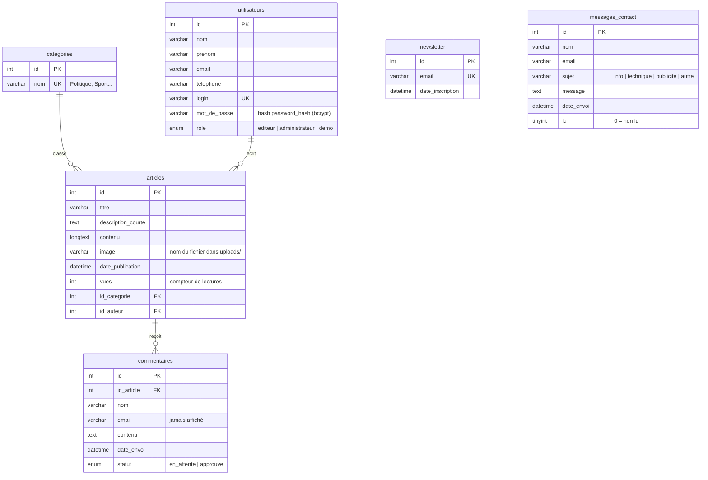

# Base de données — Xibaar Yi

Base MySQL `xibaar_yi` (encodage `utf8mb4`, pour les accents et les emojis).
Création complète : [`database/database.sql`](../database/database.sql).

## Schéma

> Le diagramme s'affiche directement sur GitHub. Dans VS Code, il faut l'extension
> « Markdown Preview Mermaid Support ».

## Relations

| Relation | Type | Règle à la suppression |
|---|---|---|
| Une **catégorie** classe plusieurs **articles** | 1 → N | `ON DELETE CASCADE`, mais l'application **refuse** de supprimer une catégorie qui contient des articles |
| Un **utilisateur** écrit plusieurs **articles** | 1 → N | `ON DELETE CASCADE`, mais l'application **refuse** de supprimer un auteur qui a des articles |
| Un **article** reçoit plusieurs **commentaires** | 1 → N | `ON DELETE CASCADE` : supprimer un article supprime ses commentaires |

`newsletter` et `messages_contact` sont indépendantes : elles stockent ce que les visiteurs
envoient, sans lien avec les autres tables.

**Pourquoi refuser des suppressions alors que la base ferait la cascade ?**
La cascade est pratique pour les commentaires (sans leur article ils n'ont plus de sens),
mais dangereuse pour les catégories et les auteurs : un clic effacerait des dizaines d'articles.
Le contrôle est donc fait dans `admin/categories/supprimer.php` et `admin/utilisateurs/supprimer.php`.

## Tables

### `categories`
Rubriques du journal. `nom` est **unique** : deux catégories ne peuvent pas avoir le même nom.

### `utilisateurs`
Membres de la rédaction (les visiteurs n'ont pas de compte).
- `login` est **unique**.
- `mot_de_passe` contient un **hash** `password_hash()` (bcrypt, 60 caractères), jamais le
  mot de passe en clair. La colonne fait 255 caractères pour les futurs algorithmes.
- `role` : `editeur` (articles, catégories, messages, commentaires) ou
  `administrateur` (tout, plus la gestion des utilisateurs),
  ou `demo` (voit tout le back-office, ne peut rien modifier : compte public du portfolio).

### `articles`
- `description_courte` : le résumé affiché sur l'accueil.
- `image` : seulement le **nom** du fichier ; l'image est dans `public/uploads/`.
- `vues` : +1 à chaque lecture, une seule fois par visiteur et par session.

### `commentaires`
Créés avec `statut = 'en_attente'` ; visibles sur le site seulement quand un membre de la
rédaction les passe à `approuve`.

### `newsletter`
`email` est **unique** : la base elle-même refuse les doublons, en plus de la vérification
faite dans `traitement_newsletter.php`.

### `messages_contact`
Messages du formulaire Contact. `lu` passe à 1 quand la rédaction marque le message comme lu.

### `tentatives_connexion`
Une ligne par échec de connexion (adresse IP + date). À partir de 5 échecs en 15 minutes,
`connexion.php` refuse les nouvelles tentatives de cette adresse IP. Les lignes de plus d'un jour
sont supprimées automatiquement, et une connexion réussie efface celles de son adresse IP.
Table indépendante (aucune clé étrangère).

## Évolutions : les migrations

Quand la structure change, on ajoute un script dans [`database/migrations/`](../database/migrations/)
pour mettre à jour les bases **déjà créées** (sans perdre les données) :

| Migration | Changement |
|---|---|
| `001_mot_de_passe_255.sql` | colonne mot de passe élargie pour `password_hash()` |
| `002_messages_contact.sql` | table `messages_contact` |
| `003_newsletter_email_unique.sql` | suppression des doublons + index unique sur l'email |
| `004_messages_lu.sql` | colonne `lu` (messages lus / non lus) |
| `005_articles_vues.sql` | colonne `vues` (articles les plus lus) |
| `006_commentaires.sql` | table `commentaires` |
| `007_tentatives_connexion.sql` | table `tentatives_connexion` (limite des échecs de connexion) |
| `008_compte_demo.sql` | rôle `demo` + compte de démonstration en lecture seule |

Une base neuve n'en a pas besoin : `database.sql` contient déjà la structure finale.
